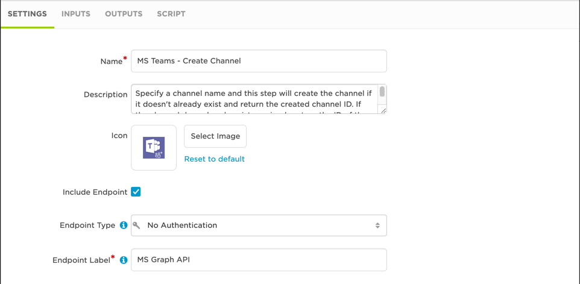

# Create a MS Teams Channel in an existing Team for xMatters Flow Designer
This is a collection of custom steps that use the new Microsoft Graph API.  The ultimate aim here is to create a new Channel in an existing Team in MS Teams but you may well find use for some steps on their own to do other things.

We're going to be putting in X steps which each do things that help us create a channel.  These are:
1. **Authenticate** - Use some predefined tokens to authenticate on the API and get an access token that lets us cary out other actions for a short time.
1. **Get Team ID** - Find an existing Team knowing the Group and Team name and bring back their IDs.
1. **Create Channel** - Create a channel in an existing Team knowing the ID of the existing Team.

The usual use here would be to have xMatters create a new channel dedicated to the resolution of a newly discovered issue, perhaps when xMatters is initiated automatically by some monitoring tool or perhaps when a Major Incident is newly declared.  If you find other uses for this though please let us know!

This is repo makes part fo the [xMatters Labs Flow Steps](https://github.com/xmatters/xMatters-Labs-Flow-Steps) parent repo.


---------

<kbd>
  
</kbd>

---------

# Files - to do

* [logo.png](/media/hat.png) - Logo for the Hat Factory
* [otherfile.file](/otherfile.file) - Some other file that does something useful.

# Microsoft Teams
[Microsoft Teams](https://products.office.com/en-us/microsoft-teams/group-chat-software) is the chat tool that comes as part of the [Microsoft Office 365](https://www.office.com/) suite.  MS Teams has its own (slightly older) API but we're not making use of it here.  Instead we're using the [Microsoft Graph API](https://docs.microsoft.com/en-us/graph/overview) for Office 365 which can do all sorts of things in the MS Office environment, including creating a Channel in an MS Teams Team.

# Microsoft Office 365 setup via Azure Console -  to be tidied
Add details here about how to generate an auth token or to create a user.

## Sub Title
Azure side of things

Searched for App Registrations.

Register an App to handle the connection between the API and Teams.


Note Application ID is also Client ID. And Directory ID is also Tenant ID.


API Permissions

Clicked API permissions on left menu.
Then + Add a permission.

On the Request API permissions page, at the very bottom under Supported Legacy APIs we selected the Azure Active Directory Graph. Why is it a legacy? Will it vanish in 6 months time?


On the next page, we cose Application permissions on the right hand tile, then checked Directory.ReadWriteAll

Ended up like this…


But App.Catalog.ReadWrite.All was to search for the official xMatters app. Didn’t work though.


# Flow Designer Steps

## Create Channel
Creates a new Channel, of any valid given name, within an existing Team in MS Teams.

Before you are able to call this step your flow will have had to have used the **Authenticate** step to get a session token which is then passed to this step as an input.  Most likely you will also want to have used the **Get Team ID** step in the flow to get the unique ID of the Team you want to create the channel in as that also needs to be passed to this step.  (If you want to specify the Team ID in a constant that's fine, but we prefer using a constant for the Team Name.)

In your communication plan click *Create a custom step* on the *CUSTOM* tab within flow designer and configure the for tabs as follows.

### Settings

| Field | Value |
| ----- | ----- |
| Name | MS Teams - Create Channel |
| Description | Specify a channel name and this step will create the channel if it doesn't already exist and return the created channel ID. If the channel does already exist we simply return the ID of the channel.  |
| Icon | <kbd> </kbd> |
| Include Endpoint | Yes |
| Endpoint Type | No Authentication |
| Endpoint Label | MS Graph API |




### Inputs

| Name  | Required? | Min | Max | Help Text | Default Value | Multiline |
| ----- | ----------| --- | --- | --------- | ------------- | --------- |
| Session Authentication Token  | Yes | 0 | 2000 | You must use the MS Teams - Authenticate step earlier in the flow and input the returned session token here |  | No |
| Channel Name | Yes | 0 | 2000 | The name of the channel you want to create |  | No |
| Channel Description | No | 0 | 2000 | Help others find the right channel by providing a description |  | Yes |
| Group ID | Yes | 0 | 2000 | This is the ID of the Office 365 Group that is associated with the Team we want to create the Channel in. You can use the MS Teams - Get Team IDs step earlier in the flow to find this from the Team name. |  | No |


### Outputs

| Name |
| ---- |
| Channel ID |
| Channel Already Existed? |

### Script

```javascript
output['Channel Already Existed?'] = 'FALSE';

if ( getChannel(input['Channel Name'], input['Group ID'], input['Session Authentication Token']) )  {
    console.log('The channel already exists, returning channel ID to flow');
    output['Channel Already Existed?'] = 'TRUE';
    output['Channel ID'] = '';   //TO DO
} else {

    if ( createChannel(input['Channel Name'], input['Channel Description'], input['Group ID'], input['Session Authentication Token'] )  ) {
        console.log('The channel did not exist and so was created.');
        output['Channel ID'] = '';   //TO DO
    } else {
        console.log('The channel did not exist bust something went wrong trying to create it.');
        output['Channel ID'] = '';
    }

}


/** createChannel  (RSelby & AWatson - xMatters Consulting)
  * Make a Channel inside a Team  
  * Returns Channel object, or false if it can't be created.
  * webUrl is one of the properties of the Channel object, which could be useful
  */
function createChannel(channelName, channelDesc, groupId, token) {
    console.log("createChannel starting for "+channelName + " in group "+groupId);

    var request = http.request({
      "endpoint": "MS Graph API",
      "path": "/v1.0/teams/"+groupId+"/channels",
      "method": "POST",
      "headers": {
      "Authorization": "Bearer " + token
      }
    });

    // Configure Channel settings
    var data = {
     "displayName":channelName,
     "description":channelDesc
    };

    var response = request.write(data);
    var statusCode = response.statusCode;
    if ( statusCode== 201) {
        json = JSON.parse(response.body);
        console.log('createChannel - Created it. Returning Channel '+channelName);
        return json;
    }
    else     {
        console.log("createChannel statusCode is "+statusCode +". Unable to create channel");
    }
    return false;
}


/** getChannel  (RSelby & AWatson - xMatters Consulting)
  * Look for a Channel within a Group
  * Return it as an object if we find it. Otherwise false.
  */
function getChannel(channelName, groupId, token)
{
    console.log("getChannel - Looking for "+ channelName + " in group "+groupId);

    var request = http.request({
      "endpoint": "MS Graph API",
      "path": "/v1.0/teams/"+groupId+"/channels",
      "method": "GET",
      "headers": {
      "Authorization": "Bearer " + token
     }
    });
    var response = request.write();
    var statusCode =response.statusCode;
    var channels = [];
    if (statusCode==200){
        json = JSON.parse(response.body);
        channels = json.value;    
        channelCount = json.value.length;
        if (!channelCount){
            console.log('getChannel - No channels returned when looking for name ' + channelName + '!');
            return false;
        }

        console.log('getChannel - Found '+channelCount + " channels. Looking for "+channelName );
        for (var j=0;  j < channelCount; j++)
        {
            var channel = channels[j];
            console.log('getChannel - '+j+'. Comparing '+ channel.displayName);

            if (channel.displayName == channelName) {
                console.log('getChannel - Found!');
                return channel;
            }
        }
        console.log('getChannel - Channels returned but no '+channelName+' channel found in the list');
        return false;
    }

    console.log('getChannel - status '+statusCode+'. Not good.');
    return false;
}
```


## Action Name 2
The "Update App Record" step creates a record in the `APPLICATION_NAME` and such and such.

### Settings

| Field | Value |
| ----- | ----- |
| Name | Update a Hat |
| Description | Sends an update a hat request to the hat factory.  |
| Icon | <kbd> </kbd> |
| Include Endpoint | Yes |
| Endpoint Type | Basic Auth |
| Endpoint Label | Hat Factory |

### Inputs

| Name  | Required? | Min | Max | Help Text | Default Value | Multiline |
| ----- | ----------| --- | --- | --------- | ------------- | --------- |
| Name  | Yes | 0 | 2000 | This is the color of the hat to create | Blue | No |
| Color | No | 0 | 2000 | The major color of the hat. Possible values are Red, White, Blue | Blue | No |


### Outputs

| Name |
| ---- |
| Hat |
| Link |

### Script

```javascript
// Retrieve the name and color values
var name = input['Name'];
var color = input['Color'];

// Make the request
var req = http.request({
   "endpoint": "Hat Factory",
   "path": "/hat",
   "method": "POST",
   "headers": {
      "Content-Type": "application/json"
   }
});

var hatPayload = {
   "name": name,
   "color": color
};

var resp = req.write( hatPayload );

```
